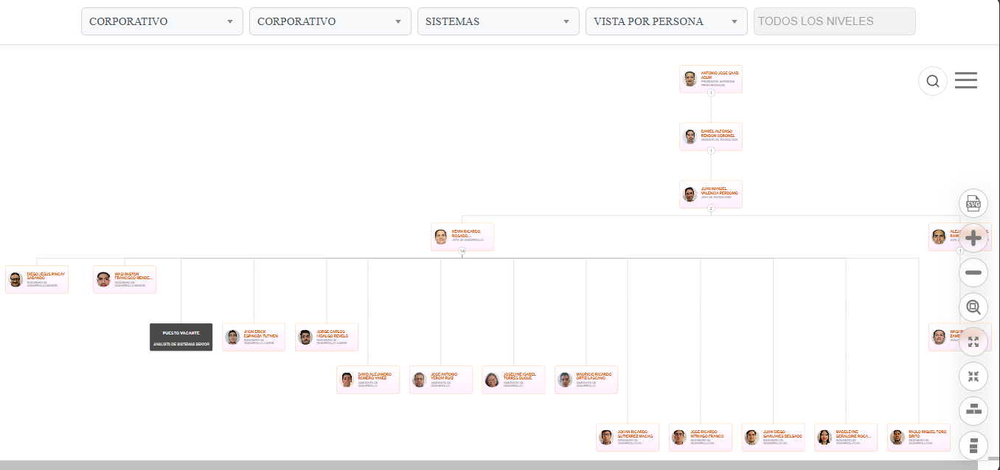

  <h1>🏢 Organigrama Corporativo LIRIS S.A.</h1>

  <blockquote>
        
Visualización interactiva de la estructura organizacional basada en <strong>Balkan OrgChart JS</strong>. Proyecto Frontend diseñado para integrarse en el ecosistema corporativo de LIRIS, consumiendo la API de nómina en tiempo real.

    </blockquote>

   

        
        
        
    

  

  <h2>📸 Galería Visual</h2>
    
Interfaz adaptativa diseñada para ofrecer la mejor experiencia según el dispositivo.

  <table border="0" style="width: 100%;">
        <tr>
            <td style="width: 70%; vertical-align: top;">
                <h3>🖥️ Vista de Escritorio</h3>
                
Panel completo con filtros laterales, búsqueda flotante y controles de exportación.

                
            </td>
            <td style="width: 30%; vertical-align: top;">
                <h3>📱 Vista Móvil</h3>
                
Diseño compacto con filtros en grilla 2x2 y búsqueda anclada.

                
            </td>
        </tr>
    </table>
    
  

  <h2>📂 Estructura del Repositorio</h2>
    <pre><code>
Organigrama-Jerarquias/
├── 📁 Balkan/                  # Librería Base de Balkan OrgChart JS
├── 📁 BalkanPro/               # Módulos Pro de Balkan (Exportación, PDF)
├── 📄 index_sistemas_jerarquias.html  # 👈 [CORE] Lógica de renderizado.
├── 🎨 styles.css               # 👈 [CORE] Estilos personalizados y Responsive.
├── 🖼️ Logo-Liris.png           # Asset gráfico.
├── 📁 img/                     # Capturas de pantalla para documentación.
├── 📄 README.md                # Este archivo.
│
├── ⚠️ ARCHIVOS LEGACY:
├── 📁 orgchart/                # (Experimental) Pruebas.
├── 📄 main.js                  # Sin uso.
└── 📄 visor.html               # Visualizador secundario.
    </code></pre>

  <h2>⚙️ Funcionalidades Principales</h2>

  <h3>1. Navegación y Herramientas</h3>
    <ul>
        <li><strong>Zoom Inteligente:</strong> Control total con botones flotantes y "Ajustar a Pantalla".</li>
        <li><strong>Exportación:</strong> Generación nativa de reportes en <strong>PDF</strong>, <strong>PNG</strong> y <strong>SVG</strong>.</li>
        <li><strong>Vistas Flexibles:</strong> Alternancia entre orientación vertical/horizontal y expansión/colapso de ramas.</li>
    </ul>

  <h3>2. Filtros y Búsqueda (Select2)</h3>
    
Sistema de filtrado avanzado para segmentar la organización por:

    <ul>
        <li><strong>Línea de Negocio</strong>, <strong>Centro de Costo</strong> y <strong>Departamento</strong>.</li>
        <li><strong>Búsqueda Global:</strong> Localización instantánea de colaboradores por nombre o cargo.</li>
    </ul>

  <h3>3. Ficha de Detalle</h3>
    
Modal interactivo con información del empleado y accesos directos a:

    <ul>
        <li>📘 Manual de Funciones</li>
        <li>📗 Manual de Usuario</li>
        <li>📙 Manual de Procedimientos</li>
    </ul>

  <h2>🚀 Instalación y Desarrollo Local</h2>
    
Este proyecto no requiere compilación (es HTML/JS estático). Para ejecutarlo localmente:

  <ol>
        <li>
            <strong>Clonar el repositorio:</strong>
            <pre><code>git clone https://github.com/davidromeroy/Organigrama-Jerarquias.git</code></pre>
        </li>
        <li>
            <strong>Ejecutar:</strong>
            
Se recomienda usar una extensión como <strong>Live Server</strong> en VS Code para evitar problemas de CORS con los archivos locales.

        </li>
        <li>
            <strong>Configuración (Simulación de Usuario):</strong>
            
En local, el <code>postMessage</code> del padre no existe. Para probar con un usuario específico, busca en <code>index_sistemas_jerarquias.html</code> la variable:

            <pre><code>// Descomentar para pruebas locales por ejemplo
          receivedUserId = "interno\\dromero"; //Asistente de desarrollo</code></pre>
          
Para pruebas debe cambiar el url de la api por la suya teniendo en cuenta la estructura de la api original usada.

        </li>
    </ol>

  <h2>🔄 Lógica de Datos (API)</h2>
    
El sistema consume un JSON plano con la siguiente estructura crítica:

  <pre><code class="language-json">
 "Persona": [
  {
    "codigoEmpleado": "15",
    "nombre": "ANTONIO JOSE",
    "apellido": "SAAB ADUM",
    "userid": "interno\\ajsaab",       // Clave para autenticación
    "foto": "http://soporte.liris.com.ec/fotorrhh/...",
    "emailCorporativo": "ajsaab@liris.com.ec",
    
    // --- MOTOR JERÁRQUICO ---
    "codigoPosicion": "00001",         // ID Único del Nodo
    "codigoPosicionReporta": "00006",  // ID del Jefe
    
    "puesto": "PRESIDENTE SERVICIOS PROFESIONALES",
    
    // --- CAMPOS DE FILTRADO ---
    "nombreDepartamento": "DIRECTORIO",
    "nombreCentroCosto": "CORPORATIVO",
    "nombreLineaNegocio": "CORPORATIVO",
    
    // --- DOCUMENTACIÓN Y ESTADO ---
    "rutaManual": "Documentos compartidos/...", // Path base para los manuales
    "vacante": "0",          // "0" = Ocupado, "1" = Vacante (Estilo visual distinto)
    "nivelJerarquico": "1"   // Define el color del borde
  }
]
    </code></pre>

  <h2>🔄 Contexto de Integración</h2>
    
Este módulo Frontend opera dentro de la intranet corporativa bajo un wrapper <strong>ASP.NET</strong> (<code>index.aspx</code>) que gestiona la autenticación y pasa el contexto de usuario vía <code>postMessage</code>.

  <h2>📱 Estrategia Responsive</h2>
    <table border="1" cellpadding="10" cellspacing="0" style="width: 100%; border-collapse: collapse;">
        <thead style="background: #f4f4f4;">
            <tr>
                <th>Dispositivo</th>
                <th>Comportamiento UI</th>
            </tr>
        </thead>
        <tbody>
            <tr>
                <td><strong>Escritorio</strong></td>
                <td>Vista completa, controles expandidos y filtros laterales.</td>
            </tr>
            <tr>
                <td><strong>Tablet (&lt;768px)</strong></td>
                <td><strong>Modo Grilla:</strong> Filtros en 2x2. Búsqueda anclada a la izquierda (60%).</td>
            </tr>
            <tr>
                <td><strong>Móvil (&lt;400px)</strong></td>
                <td><strong>Modo Compacto:</strong> Fuentes reducidas (10px), inputs delgados (30px) y márgenes seguros.</td>
            </tr>
        </tbody>
    </table>

  <h3>🌍 Compatibilidad</h3>
    
Optimizado para:

    <ul>
        <li>✅ Google Chrome (Desktop & Mobile)</li>
        <li>✅ Safari (iOS & macOS)</li>
        <li>✅ Microsoft Edge</li>
    </ul>

  <h2>👨‍💻 Autor / Mantenedor</h2>
    

      <strong><a href="https://www.linkedin.com/in/daroyane/" target="_blank" style="text-decoration: none; color: #0077b5; font-size: 1.1em;">David Romero Yánez</a></strong> 
      <em>Ingeniero de Desarrollo</em> 
        Departamento de Sistemas - LIRIS S.A.
    

  

    
<em>Documentación actualizada a Noviembre 2025.</em>

